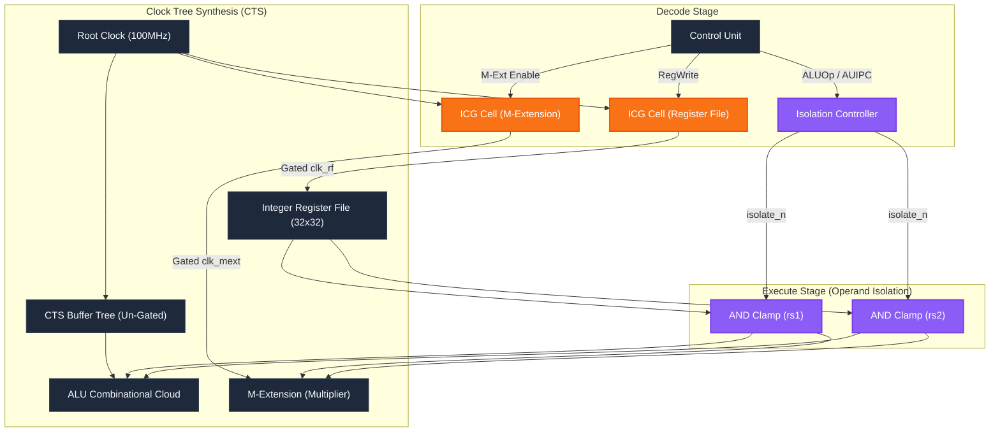

# Final Architecture Diagram (v017)

This diagram visualizes the final Clock-Power Codesign modifications applied to the Wally (CVW) RISC-V core.

## Implementation Notes
- **Orange Nodes (ICG):** Latch-based Integrated Clock Gating cells (`cvw_icg_cell.sv`) injected to shut off the clock to dense sequential blocks when they are not written to.
- **Purple Nodes (Operand Isolation):** Combinational AND-clamps that lock the data inputs to `0` when the execution units are not active, preventing power-hungry combinational toggling from propagating through the ALU and Multiplier.
